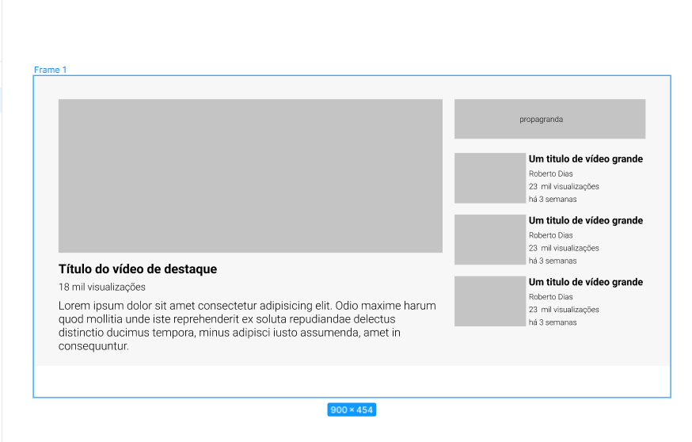
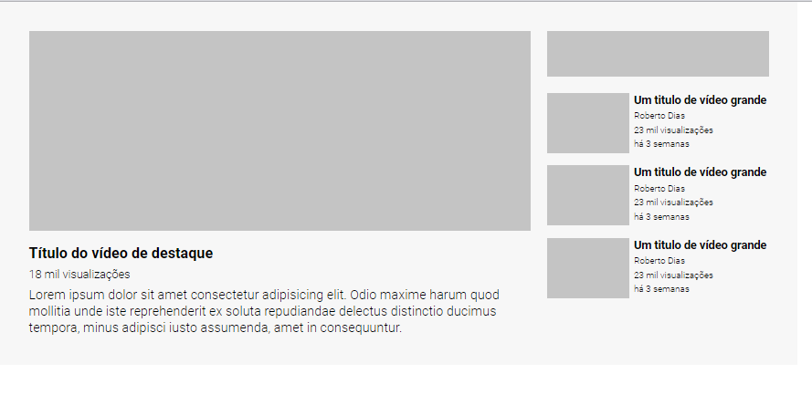

# Desafio - Fazer uma cópia do layout usando GRID

## Projeto
Este projeto, foi um desafio onde o objetivo é copiar um layout do youtube usando as tecnicas de GRID conforme ensinadas nas aulas. 

### Imagem Proposta:
[
    
]

## Desenvolvimento
Para o desenvolvimento deste desafio, foi criado o layout utilizando o GRID conforme solicitado. 
Alguns desafios em aplicar a "grid-template-area", mas com a revisão do conteúdo foi possível chegar a conclusão.

### Imagem Desafio Conluído:
[
    
]
